# Storing & Accessing HL7 messages in MongoDB with NextGen (Mirth) Connect and Mongo Compass

## Table of Contents

* [Introduction](#introduction)

    * [Prerequisites](##prerequisites)

    * [General Architecture](#general-architecture)

* [Connecting Compass to MongoDB](#connecting-compass-to-mongodb)

* [Prune the Database](#prune-the-database)

* [Writing HL7 to MongoDB](#writing-hl7-to-mongodb)

* [Access MongoDB HL7 Messages from Code](#access-mongodb-hl7-messages-from-code)

# Introduction

**HL7v2** is a message format in pipe-delimited ("|") strings. This makes for a small message size (kb) but is terse and unwieldy for data mining and analytics. The data contained in an HL7 message is heavily nested.

**NextGen (Mirth) Connect** is an *application middleware message queue*, designed for healthcare data. It's purpose is to process data streams and perform ETL functions.

**MongoDB** is a *document store database* used commonly for unstructured and loosely typed data. It is particularly good at storing nested data structures that don't lend themselves to tabular structures like relational databases.

In this example we will take an inbound message, transform it into strict JSON and insert into a MongoDB Collection using the Java drivers for Mirth.

## Prerequisites

* Running [NextGen (Mirth) Connect](https://www.nextgen.com/products-and-services/nextgen-connect-integration-engine-downloads) instance
    * [mongodb-java-driver](https://search.maven.org/search?q=g:org.mongodb) 
* [MongoDB Server](https://www.mongodb.com/try/download/community)
* [MongoDB Compass Client](https://www.mongodb.com/try/download/compass)

Setup and configuration of Mirth with the Mongodb-Java-Driver can be found a [different set of instructions](https://github.com/morningtundra/NextGen_Mirth_Recipes).

## General Architecture

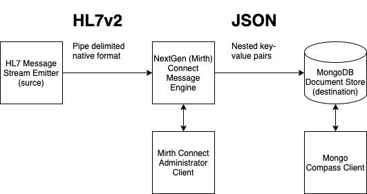

# Connecting Compass to MongoDB

Launch the Compass desktop client and select *Fill in connection fields individually*


Enter the hostname of the machine running the MongoDB server and select *Connect*.


# Prune the Database

The size and velocity of inbound HL7 messages is a direct reflection of hospital activity. To prevent the size of the database overwhelming available disk space, the Collection of Documents (HL7 messages) needs to be pruned by deleting oldest Documents.

We can do this with a Shell command using the mongodb `.deleteMany()` function.

Open the MongoDB Shell by clicking **1** or **2** at the bottom of the window.

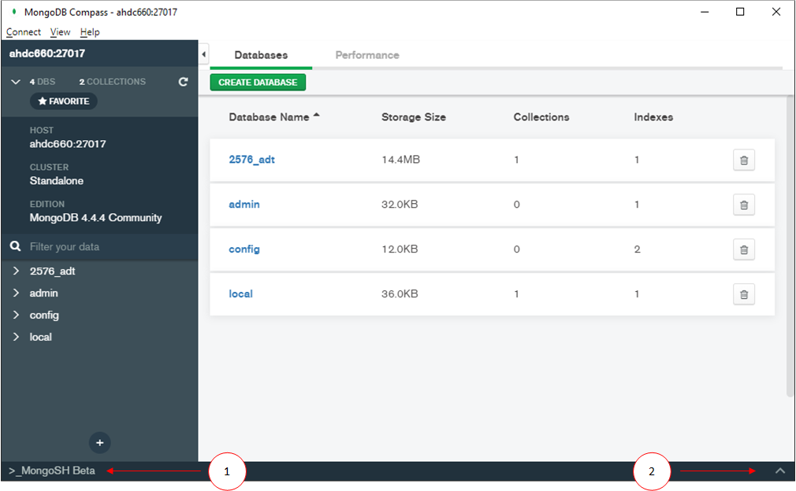

Note the **Storage Size** indicates the database *extent* size and not the actual Collection size. It represents disk space reserved to hold the Collection and may include empty disk blocks. This value may not change after pruning the collection.

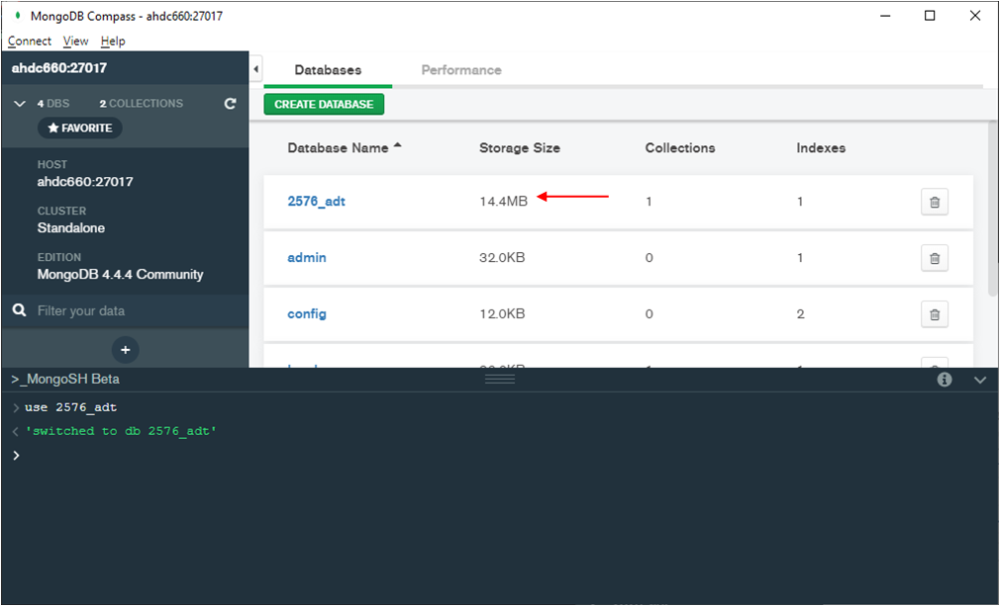

Connect to the database with the `use` utility and supply the database name.

    > use a567_adt

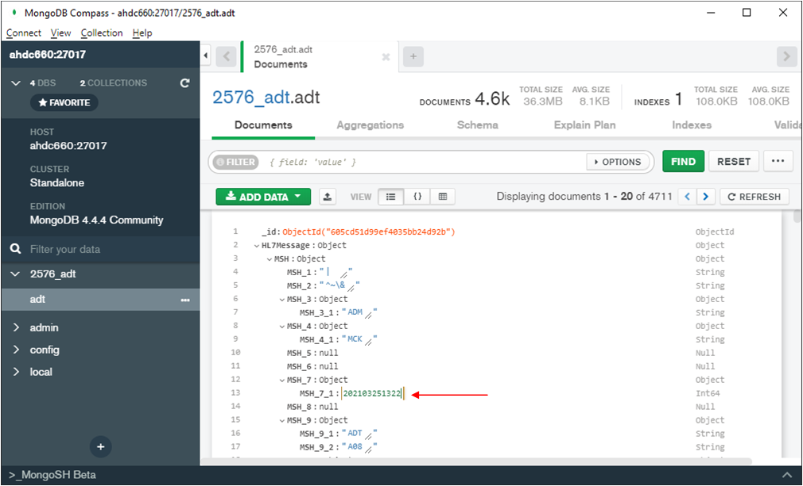

For this example we will use a date stored as an integer in the element `HL7Message.MSH.MSH_7.MSH_7_1`.

We will delete all records with a date older, prior, or less than (`$lt`) 2021, March 25th, 1PM. This date will be represented as the value `202103251400`.

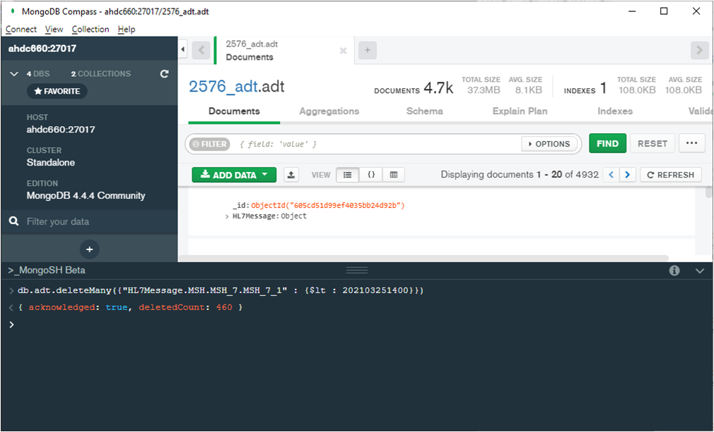

In the Shell window issue the command

    > db.adt.deleteMany({"HL7Message.MSH.MSH_7.MSH_7_1" : {$lt :202103251400 }})

A simple way to validate the date range of remaining Documents (messages) can be found in the `Schema` tab.

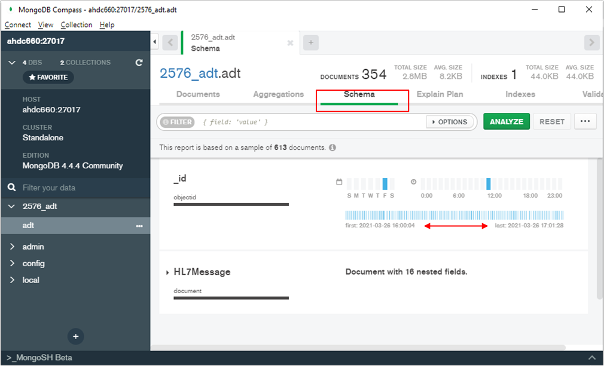

# Writing HL7 to MongoDB

This step has two components - a Transformer and a Javascript Writer.

## New MongoDB Destination

Create a `New Destination` and give it a useful name.

Set the `Connector Type` to `Javascript Writer` and add this code to the `Javascript Writer Settings` window.

```
var mongoClient = new Packages.com.mongodb.MongoClient("localhost", 27017);
var database = mongoClient.getDatabase("2576_adt");
var collection = database.getCollection("adt");
var doc = new Packages.org.bson.Document.parse(($('toJson')));
collection.insertOne(doc);
mongoClient.close()
return;
```

Edit the hostname, database name and collection name if necessary.

Note the bson Package comes from the java driver installed into Mirth [under different instructions](https://github.com/morningtundra/NextGen_Mirth_Recipies).

It is possible in this code to use `logger.info(($('toJson')))` to log output to the `Dashboard` message logger for troubleshooting.

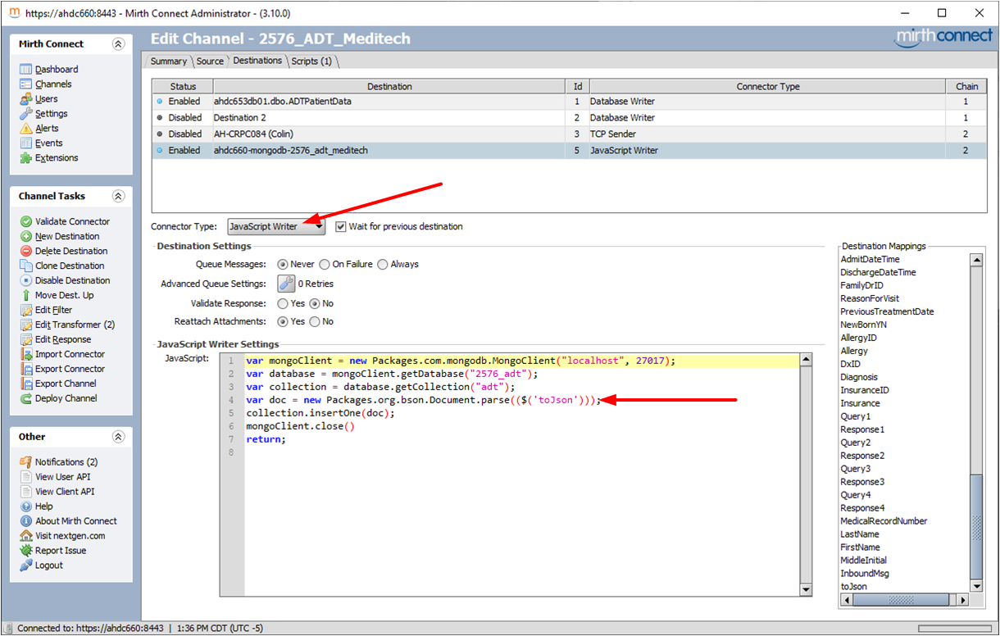

## The Transformer

This is a two step transformation. The first step performs character substitution. It replaces periods (.) with underscores (_). The JSON standard does not permit period characters in an object key. The second step will transform the internal XML message into JSON.

In the `Channel Tasks` side panel select `Edit Transformer`. 

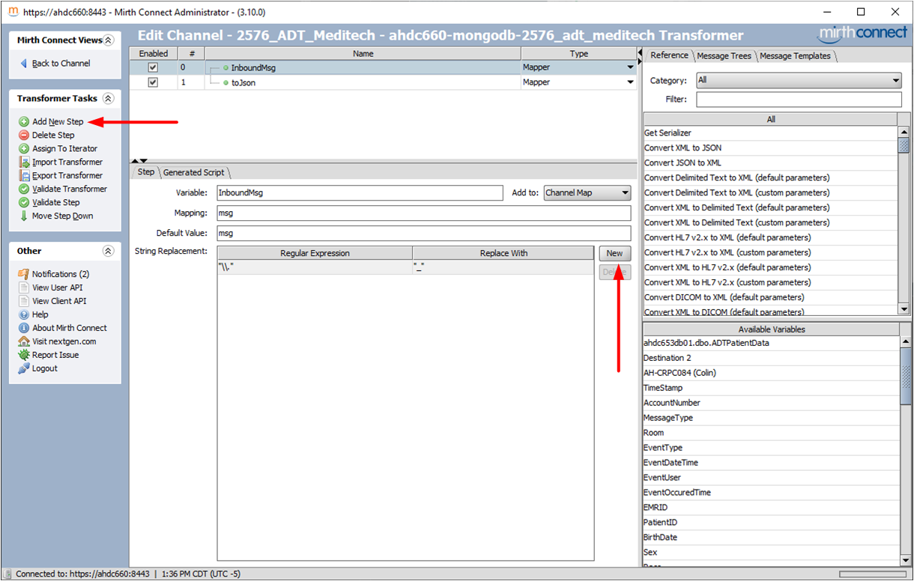

Select `Add New Step`.

Create a `Variable` called `InboundMsg` and add `img` to the `Mapping` and `Default Value` fields.

In the `String Replacement` section create a `Regular Expression` by clicking the `New` button and enter, `"\\."`.

In the `Replace With` section add `"_"`.

Add a second step by clicking `Add New Step`.

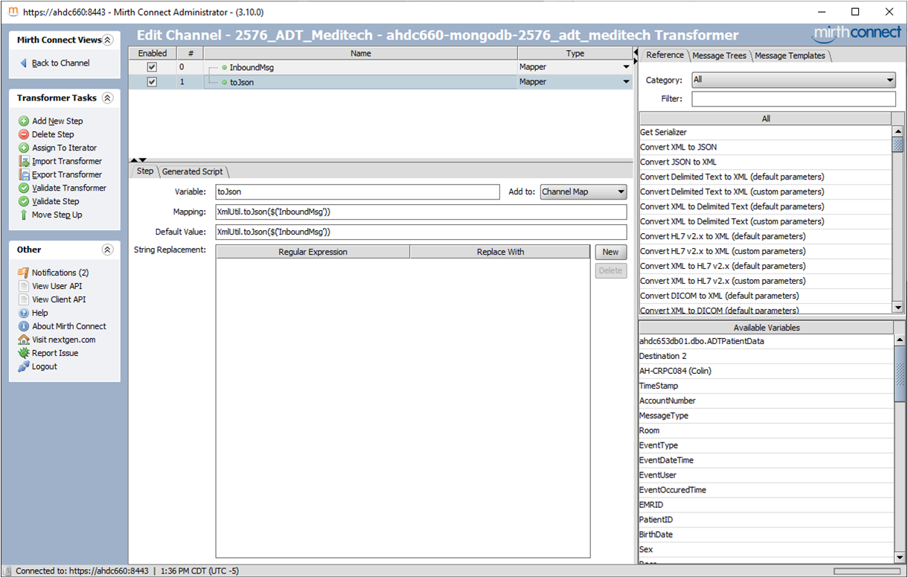

We will use the variable `InboundMsg` transformed in the previous step, and create a JSON object. We will use the inbuilt `XmlUtil.to.Json()` method.

    XmlUtil.to.Json($('InboundMsg'))

You can now select `Validate Transformer` to make sure it is syntacticly clean and then slect `Back to Channel`.

Finally, `Deploy Channel` and return to the Mirth Dashboard.

## Deploy The Channel

Once the channel is deployed it will show the transformed JSON message in the `Log Information` window.

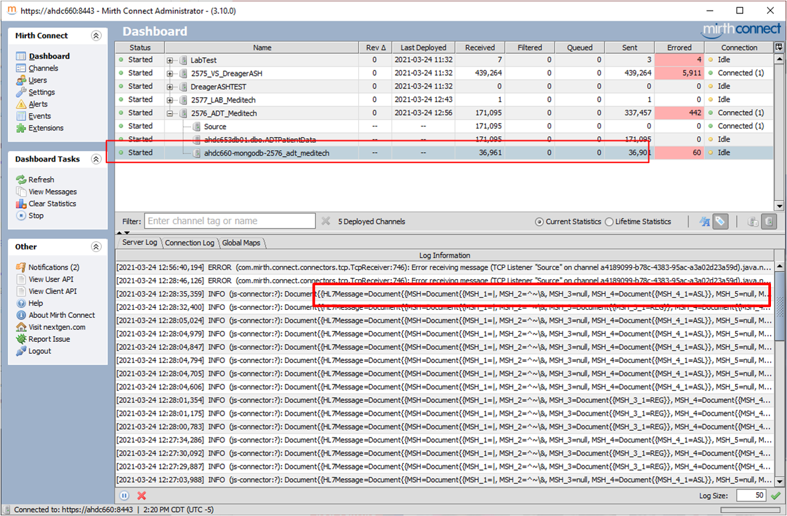

Return to the MongoDB Compass client and within the `Document` tab and press the `Refresh` button to see the new inbound messages.

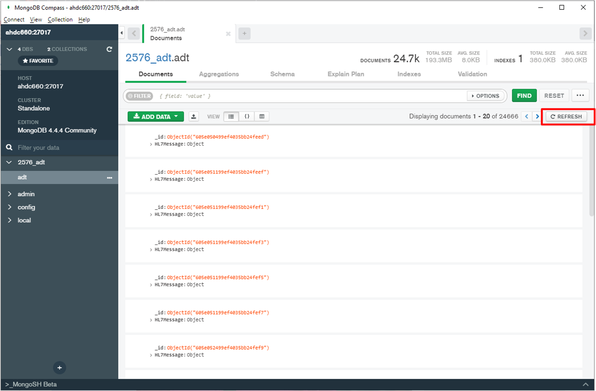

# Access MongoDB HL7 Messages from Code

MongoDB Compass has the ability to generate sample code from queries.

Develop the query in the query window and select `Export to Language`.

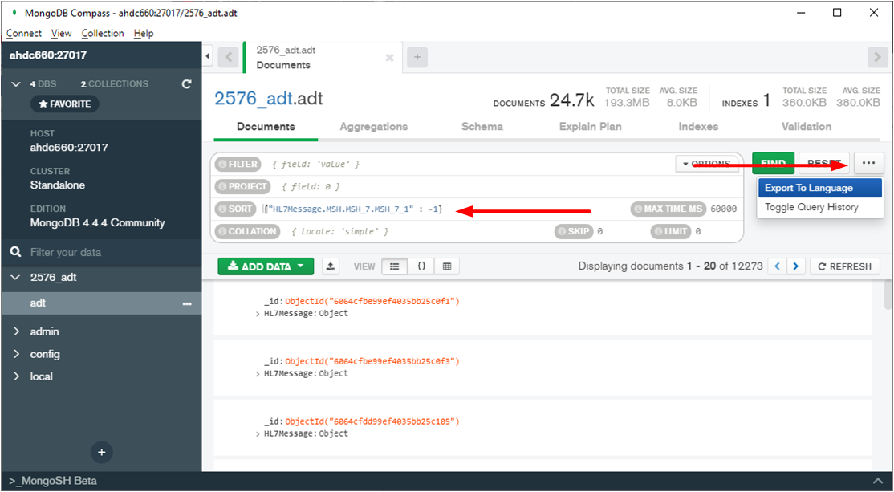

Select the target language, then copy the code sample to paste into your project.

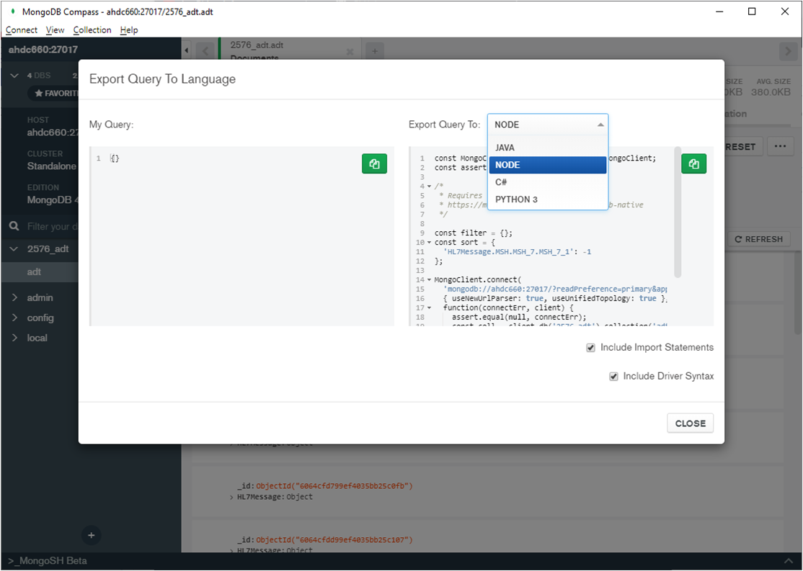